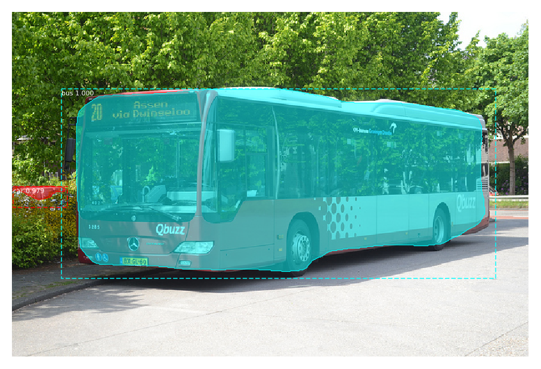
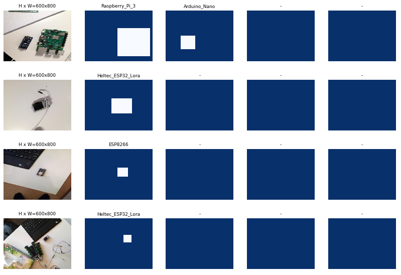
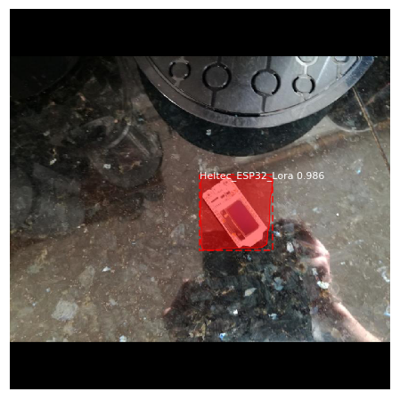
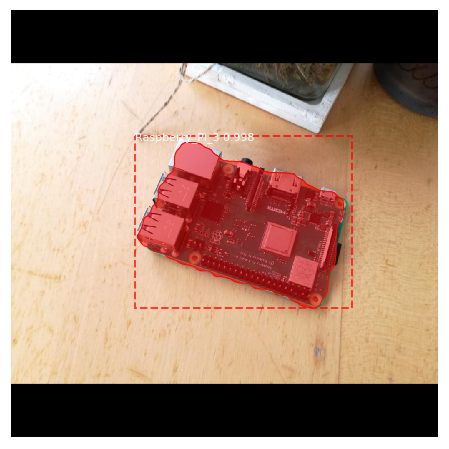

# MaskRCNN Object Detection and Segmentation


This repository shows you how to do object detection and instance segmentation with [MaskRCNN in Keras](https://github.com/matterport/Mask_RCNN).

## Installation

1. Clone the repository 
    ```git clone https://github.com/matterport/Mask_RCNN```

2. Install dependencies
    ```bash
    cd Mask_RCNN
    pip3 install -r requirements.txt
    ```

3. Run setup
    ```bash
    python3 setup.py install
    ```

4. (Optional) To train or test on MS COCO install pycocotools from one of these repos. They are forks of the original pycocotools with fixes for Python3 and Windows (the official repo doesn't seem to be active anymore).
    * Linux: https://github.com/waleedka/coco
    * Windows: https://github.com/philferriere/cocoapi. You must have the Visual C++ 2015 build tools on your path (see the repo for additional details)

## Running a pre-trained model

To use a pre-trained model for inference, we need to download the weights, create an inference config, and create a MaskRCNN object. 

For a complete example of how to run a pre-trained model on an image take a look at ["MaskRCNN Using pretrained model.ipynb"](<MaskRCNN Using pretrained model.ipynb>).


I also created [a python script](video_detection.py) that allows you to run MaskRCNN models on videos or a webcam stream. 

[](https://youtu.be/g1-TRixHhls)

## Training a custom object detection model

MaskRCNN also allows you to train your own custom object detection and instance segmentation models. To train a model you'll need to create a class that loads in your data as well as a training config that defines properties for training. You can find the complete code inside the [MaskRCNN Microcontroller Detection.ipynb](<MaskRCNN Microcontroller Detection.ipynb>) file.

### Creating the dataloader class

As an example I'll use my [Microcontroller Detection dataset](https://www.kaggle.com/tannergi/microcontroller-detection), which was labeled with [labelImg](https://github.com/tzutalin/labelImg).

The annotation files are in PascalVOC format. So every annotations file looks as follows:
```xml
<annotation>
	<folder>object_detection</folder>
	<filename>IMG_20181228_101826.jpg</filename>
	<path>object_detection/IMG_20181228_101826.jpg</path>
	<source>
		<database>Unknown</database>
	</source>
	<size>
		<width>800</width>
		<height>600</height>
		<depth>3</depth>
	</size>
	<segmented>0</segmented>
	<object>
		<name>Arduino_Nano</name>
		<pose>Unspecified</pose>
		<truncated>0</truncated>
		<difficult>0</difficult>
		<bndbox>
			<xmin>317</xmin>
			<ymin>265</ymin>
			<xmax>556</xmax>
			<ymax>342</ymax>
		</bndbox>
	</object>
</annotation>

```

The dataloader class has three methods we need to implement:
* load_dataset()
* load_mask()
* image_reference()

```python
class MicrocontrollerDataset(utils.Dataset):
    def load_dataset(self, dataset_dir):
        pass
    
    def load_mask(self, image_id):
        pass
    
    def image_reference(self, image_id):
        pass
```

The ```load_dataset``` method will define all the classes and add all the images using the ```add_image``` method. The ```load_mask``` method will load in the masks for a given image and the ```image_reference``` method will return the path to an image given its id.

For the Microcontroller dataset the dataloader class looks as follows:

```python
class MicrocontrollerDataset(utils.Dataset):
    def load_dataset(self, dataset_dir):
        self.add_class('dataset', 1, 'Raspberry_Pi_3')
        self.add_class('dataset', 2, 'Arduino_Nano')
        self.add_class('dataset', 3, 'ESP8266')
        self.add_class('dataset', 4, 'Heltec_ESP32_Lora')
        
        # find all images
        for i, filename in enumerate(os.listdir(dataset_dir)):
            if '.jpg' in filename:
                self.add_image('dataset', 
                               image_id=i, 
                               path=os.path.join(dataset_dir, filename), 
                               annotation=os.path.join(dataset_dir, filename.replace('.jpg', '.xml')))
    
    # extract bounding boxes from an annotation file
    def extract_boxes(self, filename):
        # load and parse the file
        tree = ET.parse(filename)
        # get the root of the document
        root = tree.getroot()
        # extract each bounding box
        boxes = []
        classes = []
        for member in root.findall('object'):
            xmin = int(member[4][0].text)
            ymin = int(member[4][1].text)
            xmax = int(member[4][2].text)
            ymax = int(member[4][3].text)
            boxes.append([xmin, ymin, xmax, ymax])
            classes.append(self.class_names.index(member[0].text))
        # extract image dimensions
        width = int(root.find('size')[0].text)
        height = int(root.find('size')[1].text)
        return boxes, classes, width, height
 
    # load the masks for an image
    def load_mask(self, image_id):
        # get details of image
        info = self.image_info[image_id]
        # define box file location
        path = info['annotation']
        # load XML
        boxes, classes, w, h = self.extract_boxes(path)
        # create one array for all masks, each on a different channel
        masks = np.zeros([h, w, len(boxes)], dtype='uint8')
        # create masks
        for i in range(len(boxes)):
            box = boxes[i]
            row_s, row_e = box[1], box[3]
            col_s, col_e = box[0], box[2]
            masks[row_s:row_e, col_s:col_e, i] = 1
        return masks, np.asarray(classes, dtype='int32')
    
    def image_reference(self, image_id):
        info = self.image_info[image_id]
        return info['path']
```

Now that we have the dataloader class we can load in both training and testing set and visualize a few random images and their masks.

```python
# Create training and validation set
# train set
dataset_train = MicrocontrollerDataset()
dataset_train.load_dataset('Microcontroller Detection/train')
dataset_train.prepare()
print('Train: %d' % len(dataset_train.image_ids))
 
# test/val set
dataset_val = MicrocontrollerDataset()
dataset_val.load_dataset('Microcontroller Detection/test')
dataset_val.prepare()
print('Test: %d' % len(dataset_val.image_ids))

# Load and display random samples
image_ids = np.random.choice(dataset_train.image_ids, 4)
for image_id in image_ids:
    image = dataset_train.load_image(image_id)
    mask, class_ids = dataset_train.load_mask(image_id)
    visualize.display_top_masks(image, mask, class_ids, dataset_train.class_names)
```



### Creating config object

MaskRCNN has a Config class. It defines properties for both training and prediction, including the number of classes, gpu count and the learning rate.

You can take a look at the default config using the following code:
```python
from mrcnn.config import Config
config = Config()
config.display()
```

```
Configurations:
BACKBONE                       resnet101
BACKBONE_STRIDES               [4, 8, 16, 32, 64]
BATCH_SIZE                     2
BBOX_STD_DEV                   [0.1 0.1 0.2 0.2]
COMPUTE_BACKBONE_SHAPE         None
DETECTION_MAX_INSTANCES        100
DETECTION_MIN_CONFIDENCE       0.7
DETECTION_NMS_THRESHOLD        0.3
FPN_CLASSIF_FC_LAYERS_SIZE     1024
GPU_COUNT                      1
GRADIENT_CLIP_NORM             5.0
IMAGES_PER_GPU                 2
IMAGE_CHANNEL_COUNT            3
IMAGE_MAX_DIM                  1024
IMAGE_META_SIZE                13
IMAGE_MIN_DIM                  800
IMAGE_MIN_SCALE                0
IMAGE_RESIZE_MODE              square
IMAGE_SHAPE                    [1024 1024    3]
LEARNING_MOMENTUM              0.9
LEARNING_RATE                  0.001
LOSS_WEIGHTS                   {'rpn_class_loss': 1.0, 'rpn_bbox_loss': 1.0, 'mrcnn_class_loss': 1.0, 'mrcnn_bbox_loss': 1.0, 'mrcnn_mask_loss': 1.0}
MASK_POOL_SIZE                 14
MASK_SHAPE                     [28, 28]
MAX_GT_INSTANCES               100
MEAN_PIXEL                     [123.7 116.8 103.9]
MINI_MASK_SHAPE                (56, 56)
NAME                           None
NUM_CLASSES                    1
POOL_SIZE                      7
POST_NMS_ROIS_INFERENCE        1000
POST_NMS_ROIS_TRAINING         2000
PRE_NMS_LIMIT                  6000
ROI_POSITIVE_RATIO             0.33
RPN_ANCHOR_RATIOS              [0.5, 1, 2]
RPN_ANCHOR_SCALES              (32, 64, 128, 256, 512)
RPN_ANCHOR_STRIDE              1
RPN_BBOX_STD_DEV               [0.1 0.1 0.2 0.2]
RPN_NMS_THRESHOLD              0.7
RPN_TRAIN_ANCHORS_PER_IMAGE    256
STEPS_PER_EPOCH                1000
TOP_DOWN_PYRAMID_SIZE          256
TRAIN_BN                       False
TRAIN_ROIS_PER_IMAGE           200
USE_MINI_MASK                  True
USE_RPN_ROIS                   True
VALIDATION_STEPS               50
WEIGHT_DECAY                   0.0001
```

For training we need to change at least two properties. The NAME and the NUM_CLASSES.

```python
class MicrocontrollerConfig(Config):
    # Give the configuration a recognizable name
    NAME = "microcontroller_detection"
    
    NUM_CLASSES = 1 + 4

    GPU_COUNT = 1
    IMAGES_PER_GPU = 1

config = MicrocontrollerConfig()
config.display()
```

### Creating and training the model.

Now that we have both the Config and Dataset class we can create and train a model using the following code.

```python
# Create model in training mode
model = modellib.MaskRCNN(mode="training", config=config,
                          model_dir=MODEL_DIR)

# Which weights to start with?
init_with = "coco"  # imagenet, coco, or last

if init_with == "imagenet":
    model.load_weights(model.get_imagenet_weights(), by_name=True)
elif init_with == "coco":
    # Load weights trained on MS COCO, but skip layers that
    # are different due to the different number of classes
    # See README for instructions to download the COCO weights
    model.load_weights(COCO_MODEL_PATH, by_name=True,
                       exclude=["mrcnn_class_logits", "mrcnn_bbox_fc", 
                                "mrcnn_bbox", "mrcnn_mask"])
elif init_with == "last":
    # Load the last model you trained and continue training
    model.load_weights(model.find_last(), by_name=True)

# Train the head branches
# Passing layers="heads" freezes all layers except the head
# layers. You can also pass a regular expression to select
# which layers to train by name pattern.
model.train(dataset_train, dataset_val, 
            learning_rate=config.LEARNING_RATE, 
            epochs=5, 
            layers='heads')

# Fine tune all layers
# Passing layers="all" trains all layers. You can also 
# pass a regular expression to select which layers to
# train by name pattern.
model.train(dataset_train, dataset_val, 
            learning_rate=config.LEARNING_RATE / 10,
            epochs=10, 
            layers="all")
```



## Training a custom instance segmentation model

For instance segmentation I'll make use of [my Microcontroller instance segmentation data-set](https://github.com/TannerGilbert/Detectron2-Train-a-Instance-Segmentation-Model/blob/master/microcontroller_segmentation_data.zip), which I labeled with [labelme](https://github.com/wkentaro/labelme).

Instead of xml files we now have json files with the following format:
```json
{
  "version": "4.2.9",
  "flags": {},
  "shapes": [
    {
      "label": "Arduino_Nano",
      "points": [
        [
          318.9368770764119,
          307.30897009966776
        ],
        [
          328.4053156146179,
          307.1428571428571
        ],
        [
          323.75415282392026,
          293.0232558139535
        ],
        [
          530.2839116719243,
          269.4006309148265
        ],
        [
          549.2146596858638,
          315.9685863874345
        ],
        [
          339.79057591623035,
          341.0994764397906
        ],
        [
          336.1256544502618,
          327.7486910994764
        ],
        [
          326.1780104712042,
          328.5340314136125
        ]
      ],
      "group_id": null,
      "shape_type": "polygon",
      "flags": {}
    }
  ],
  "imagePath": "IMG_20181228_101826.jpg",
  "imageData": "...",
  "imageHeight": 600,
  "imageWidth": 800
}
```

To load in the polygon annotations we will have to make some changes to the ```load_mask``` methods.

```python
class MicrocontrollerDataset(utils.Dataset):
    def load_dataset(self, dataset_dir):
        self.add_class('dataset', 1, 'Raspberry_Pi_3')
        self.add_class('dataset', 2, 'Arduino_Nano')
        self.add_class('dataset', 3, 'ESP8266')
        self.add_class('dataset', 4, 'Heltec_ESP32_Lora')
        
        # find all images
        for i, filename in enumerate(os.listdir(dataset_dir)):
            if '.jpg' in filename:
                self.add_image('dataset', 
                               image_id=i, 
                               path=os.path.join(dataset_dir, filename), 
                               annotation=os.path.join(dataset_dir, filename.replace('.jpg', '.json')))
    
    def extract_masks(self, filename):
        json_file = os.path.join(filename)
        with open(json_file) as f:
            img_anns = json.load(f)
            
        masks = np.zeros([600, 800, len(img_anns['shapes'])], dtype='uint8')
        classes = []
        for i, anno in enumerate(img_anns['shapes']):
            mask = np.zeros([600, 800], dtype=np.uint8)
            cv2.fillPoly(mask, np.array([anno['points']], dtype=np.int32), 1)
            masks[:, :, i] = mask
            classes.append(self.class_names.index(anno['label']))
        return masks, classes
 
    # load the masks for an image
    def load_mask(self, image_id):
        # get details of image
        info = self.image_info[image_id]
        # define box file location
        path = info['annotation']
        # load XML
        masks, classes = self.extract_masks(path)
        return masks, np.asarray(classes, dtype='int32')
    
    def image_reference(self, image_id):
        info = self.image_info[image_id]
        return info['path']
```

Everything else stays the same as in the object detection example. You can find the full code in the [MaskRCNN Microcontroller Segmentation file](<MaskRCNN Microcontroller Segmentation.ipynb>).

